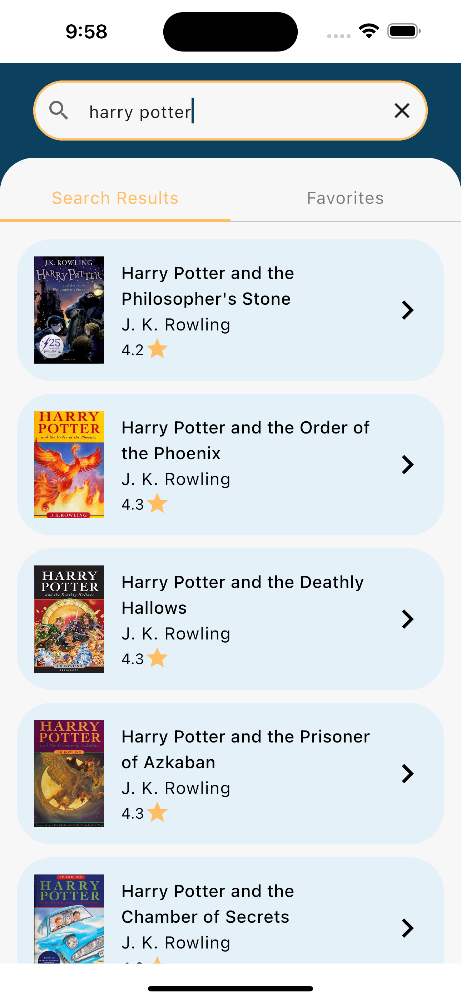
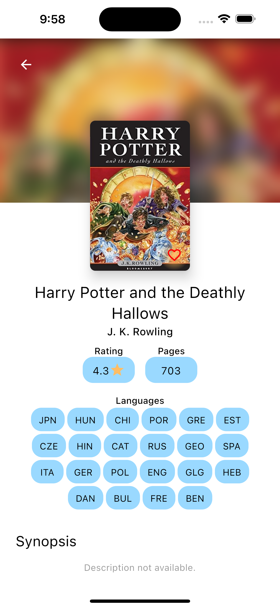
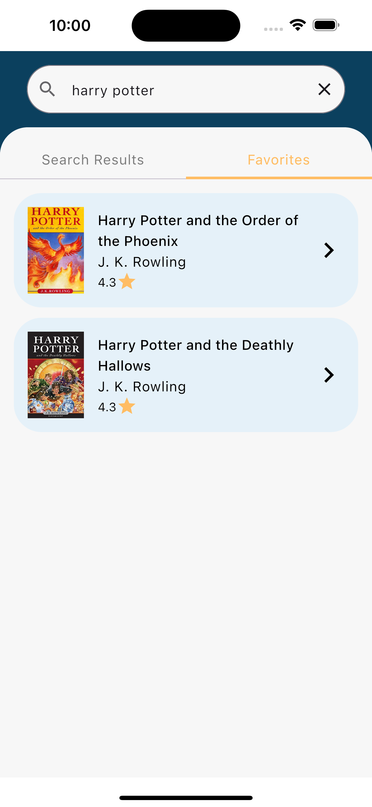
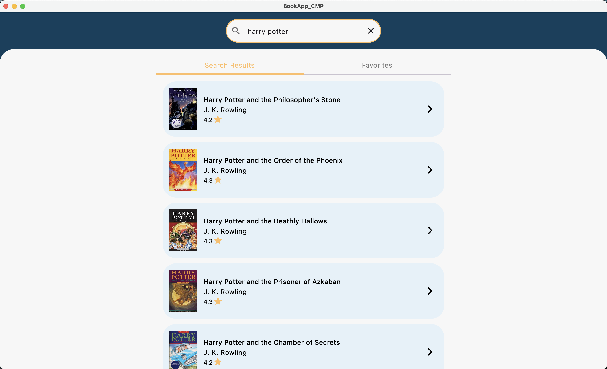
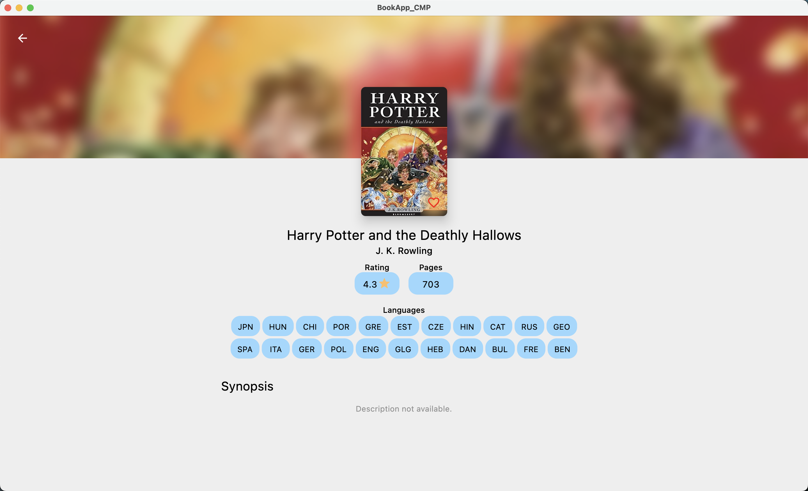
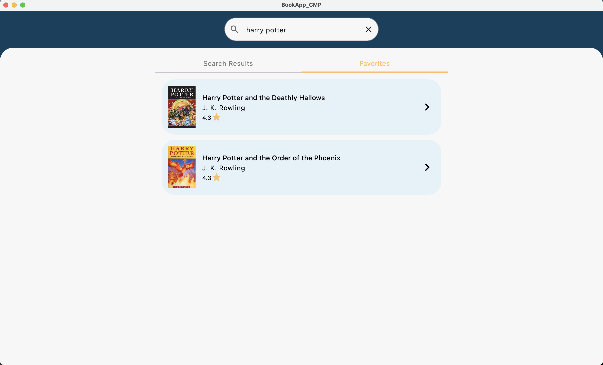

# Books App

## Overview

This is a Compose Multiplatform application for browsing and managing books. It allows users to
search for books through an API, view book details, and add books to their favorites, which are
stored locally using Room.

## 🚀 Features

- 🔍 **Search for books** using an API
- ⭐ **Add books to favorites**
- 📜 **View list of saved books** (stored locally)
- 💾 **Offline access** to favorites
- 🖥️ **Runs on Android, iOS, and Desktop**

## 🛠 Tech Stack

- **UI:** [Jetpack Compose Multiplatform](https://github.com/JetBrains/compose-multiplatform)
- **Networking:** Ktor Client
- **Local Storage:** Room Database
- **Dependency Injection:** Koin
- **Navigation:** Jetpack Compose Navigation
- **State Management:** Flow & Coroutines

## 🖥️ Screenshots

### 📱 Android

| Listing                                                      | Detail                                                      | Favorites                                                        |
|--------------------------------------------------------------|-------------------------------------------------------------|------------------------------------------------------------------|
|  |  |  |

### 🍏 iOS

| Listing                                                  | Detail                                                  | Favorites                                                    |
|----------------------------------------------------------|---------------------------------------------------------|--------------------------------------------------------------|
|  |  |  |

### 💻 Desktop

| Listing                                                      | Detail                                                      | Favorites                                                        |
|--------------------------------------------------------------|-------------------------------------------------------------|------------------------------------------------------------------|
|  |  |  |
